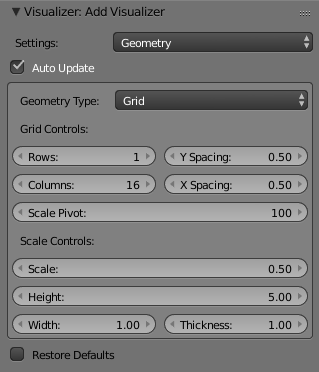
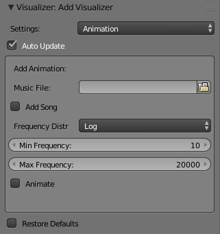

# Audio Visualizer Addon for Blender
Generates and animates visualizer bars based on a song file.

Disclamer: unfinished pre-alpha code, made back in 2013, most recent test with blender v2.76, not tested with others, can potentially be broken, use at own risk.

Official Website: [http://www.deniszholob.com/software/visualizer-addon/](http://www.deniszholob.com/software/visualizer-addon/)

## Support Me

## Install Addon
* Option A (buildscript.py)
    * In buildscript.py, edit the blender_addon_dir variable as needed
    * Run python builscript.py
* Option B (manual copy)
    * Open the blender addons folder (Ex: C:\Program Files\Blender Foundation\Blender\2.78\scripts\addons)
    * Copy the add_dz_visualizer folder there

## Enable Addon in Blender
* Start Blender
* Go to File->User Preferences->Add-ons
* Under Supported Level click "Testing"
* Find and enable the Music Visualiser addon by clicking the checkbox next to it

## Use Addon
See my [Audio Visualizer Blender Add-On Preview](https://youtu.be/uUlN-A3B_Cc) and [Daybreak Cinema Visualization](https://youtu.be/KbHaR7-7sXs) videos for examples

Generate Geometry

Animate

Notes:
* Blender will hang after checking the animate checkbox untill the animation calculations are done. Be Patient! Esp for large songs and slow computers.
* Large values for rows and columns in the grid generator will also lag, use with caution.
* Generally: smaller grids and songs = faster

## References:
[https://cgcookie.com/archive/building-an-audio-visualizer-in-python/](https://cgcookie.com/archive/building-an-audio-visualizer-in-python/)
